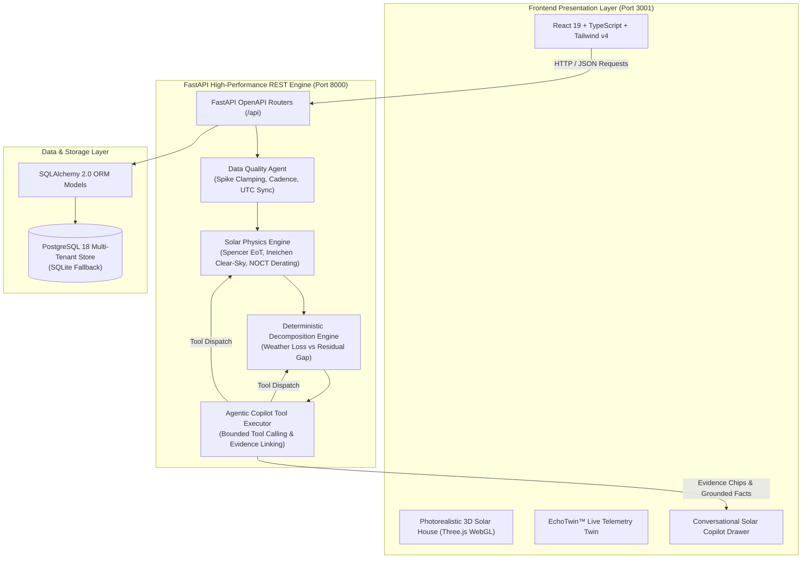
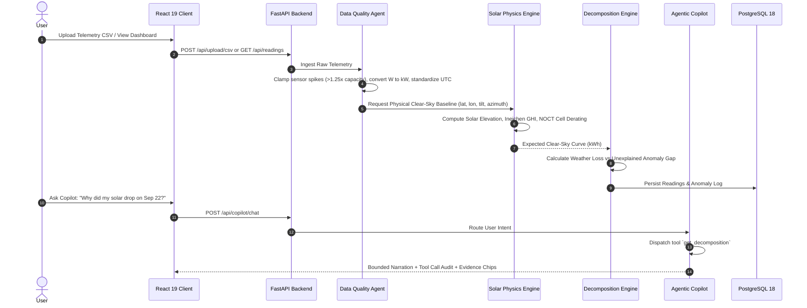
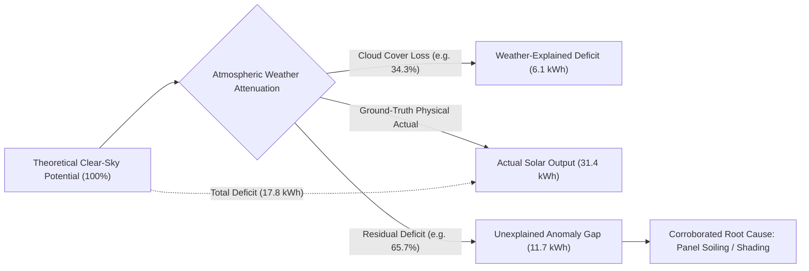

# **SolarSense AI**
### *Physics-Grounded Solar Intelligence Platform & Real-Time Telemetry Twin*

[](https://github.com/krtx17)
[](https://fastapi.tiangolo.com)
[](https://react.dev)
[](https://threejs.org)
[](https://www.postgresql.org)
[-brightgreen?style=for-the-badge&logo=pytest)](https://pytest.org)
[](LICENSE)

---

```
   ███████╗ ██████╗ ██╗      █████╗ ██████╗ ███████╗███████╗███╗   ██╗███████╗███████╗
   ██╔════╝██╔═══██╗██║     ██╔══██╗██╔══██╗██╔════╝██╔════╝████╗  ██║██╔════╝██╔════╝
   ███████╗██║   ██║██║     ███████║██████╔╝███████╗█████╗  ██╔██╗ ██║███████╗█████╗  
   ╚════██║██║   ██║██║     ██╔══██║██╔══██╗╚════██║██╔══╝  ██║╚██╗██║╚════██║██╔══╝  
   ███████║╚██████╔╝███████╗██║  ██║██║  ██║███████║███████╗██║ ╚████║███████║███████╗
   ╚══════╝ ╚═════╝ ╚══════╝╚═╝  ╚═╝╚═╝  ╚═╝╚══════╝╚══════╝╚═╝  ╚═══╝╚══════╝╚══════╝
```

> **SolarSense AI** is an enterprise-grade solar intelligence engine that bridges **astronomical solar physics** with **bounded Agentic AI**. It continuously generates physical clear-sky generation baselines, deterministically separates atmospheric weather losses from equipment anomalies (soiling, shading, inverter clipping), and powers a photorealistic 3D telemetry twin with conversational agentic guidance.

---

## ⚡ The Core Problem: Why Conventional Solar Apps Fail

Most solar monitoring apps treat solar generation as a black box:
1. **Unverifiable Guesswork:** They compare output to simple historical averages without factoring in solar geometry, seasonal sun elevation, or Plane-of-Array (POA) irradiance.
2. **Hallucination Risk:** Generative AI solutions often invent numbers, hallucinate causes, or suggest costly maintenance when the root cause was simply a passing cloud.

### 🔬 The SolarSense Breakthrough: Deterministic Physics + Scoped AI
SolarSense AI enforces a strict boundary of concerns:
- **Physics and Mathematics are 100% Deterministic:** Clear-sky potential, temperature derating, and loss attribution are calculated using closed-form physical formulas.
- **Agentic AI is Scoped & Grounded:** Large Language Models (Claude / Gemini) never compute arithmetic or assert unverified causes. They operate strictly through registered deterministic tools and prompt-bounded narration.

$$\Delta_{\text{Total Deficit}} = \Delta_{\text{Weather-Explained Loss}} + \Delta_{\text{Unexplained Anomaly Gap}}$$

---

## 📐 System Architecture



---

## 🔄 End-to-End Telemetry & Decomposition Pipeline



---

## ☀️ Deterministic Loss Decomposition Identity



---

## 🌟 Key Features

### 1. EchoTwin™ Energy Engine & 3D Solar House
* Interactive **Three.js WebGL** 3D model of a modern residential solar installation.
* Dynamic daylight cycle slider (00:00 to 24:00) reflecting real-time sun elevation, shadow casting, and battery charge states.
* Telemetry pills tracking Live Generation ($9.6\text{ kW}$ peak), Battery Storage ($13.5\text{ kWh}$ Tesla Powerwall twin), and Grid Export.

### 2. Physical Clear-Sky Baseline Engine
* **Astronomical Algorithms:** Spencer (1971) equation of time, solar declination, and true solar time hour angle.
* **Atmospheric Radiation:** Ineichen clear-sky GHI model with Kasten-Young air mass attenuation.
* **Temperature Derating:** Dynamic cell temperature calculation:
  $$T_{\text{cell}} = T_{\text{ambient}} + \left(\frac{NOCT - 20}{800}\right) \times POA$$
  Applying standard $-0.38\% / ^\circ\text{C}$ silicon derating above $25^\circ\text{C}$.

### 3. Scoped Agentic AI Copilot
* Zero-hallucination architecture: The LLM is prompt-bounded and operates strictly through deterministic tools:
  - `get_system_telemetry(system_id, date)`
  - `get_forecast(system_id, days)`
  - `get_decomposition(system_id, date)`
  - `get_health_components(system_id)`
  - `get_appliance_timing(system_id, date)`
* Produces verifiable responses accompanied by interactive **Evidence Chips** (e.g., *Camera Inspection Score 0.81*, *141 Days Since Wash*).

### 4. Utility Bill Reconciliation & NEM 2.0 Verification
* Mathematical reconciliation of net-metered electricity bills ($kWh$ consumed, generation credits, fixed grid connection charges).
* Flags billing discrepancies and cross-checks utility tariff rates.

### 5. Next-Best-Action Decision Engine
* Analyzes persistent unexplained deficits and generates ranked monetary recovery steps:
  - Panel washing schedule based on dry-day count and particulate accumulation.
  - Appliance load shifting recommendations (EV charging & heat pumps aligned with peak noon solar surplus).

---

## 📂 Repository Structure

```
Solar_Sense/
├── phase 1/                     # Architecture, PRD, TRD, Schemas & Specifications
│   └── solar/solar/             # PRD, TRD, Backend Schema, Agent Architecture docs
├── phase 2/                     # Frontend Application (React 19 + TypeScript + Vite)
│   ├── src/
│   │   ├── components/          # 3D Solar House, EchoTwin, Nav, Copilot, Modals
│   │   ├── views/               # Home, Solar, Battery, Grid, Analytics, Settings
│   │   ├── types/solar.ts       # TypeScript Domain Contracts
│   │   └── services/            # Client Services & API Adapters
│   ├── package.json             # Dev server on port 3001
│   └── vite.config.ts           # Vite + Tailwind v4 config
├── phase 3/                     # Backend Application (FastAPI + PostgreSQL)
│   └── backend/
│       ├── app/
│       │   ├── core/            # Database engine, SessionLocal, App Settings
│       │   ├── models/          # SQLAlchemy 2.0 ORM Models
│       │   ├── schemas/         # Pydantic v2 Domain Models
│       │   ├── services/        # Physics Engine, Data Quality, Decomposition, Copilot
│       │   ├── api/             # FastAPI REST Endpoints (/api)
│       │   └── main.py          # FastAPI Application Entrypoint
│       ├── tests/
│       │   ├── unit/            # Unit tests for DB, Physics, Decomposition, Copilot
│       │   └── integration/     # End-to-end API integration tests
│       ├── pytest.ini           # Test runner configuration
│       └── requirements.txt     # Python backend dependencies
├── TASKS_AND_PHASES.md          # 5-Phase implementation checklist & test logs
├── WALKTHROUGH.md               # Cross-session architectural walkthrough
├── .gitignore                   # Clean repository exclusions (no node_modules, venvs, DBs)
└── README.md                    # This document
```

---

## 🚀 Getting Started

### Prerequisites
* **Node.js** 20+ and **npm**
* **Python** 3.11+ (Python 3.13 tested)
* **PostgreSQL** 16+ (Optional — automatically falls back to SQLite for instant local runs)

---

### 1. Run the Backend API

```powershell
cd "phase 3/backend"

# Create & activate Python virtual environment
python -m venv venv
.\venv\Scripts\Activate.ps1       # On Windows
# source venv/bin/activate       # On Linux/macOS

# Install dependencies
pip install -r requirements.txt

# Start FastAPI server on port 8000
uvicorn app.main:app --host 0.0.0.0 --port 8000 --reload
```

* **Interactive Swagger UI:** [http://localhost:8000/docs](http://localhost:8000/docs)
* **API Health Check:** [http://localhost:8000/api/healthcheck](http://localhost:8000/api/healthcheck)

---

### 2. Run the Frontend UI

```powershell
cd "phase 2"

# Install frontend dependencies
npm install

# Start Vite dev server on port 3001
npm run dev
```

* **Live Web Application:** [http://localhost:3001](http://localhost:3001)

---

## 🧪 Automated Test Suite (100% Pass Rate)

Every feature is verified using automated unit and integration tests:

```powershell
cd "phase 3/backend"
.\venv\Scripts\pytest.exe -v
```

```text
============================= test session starts =============================
platform win32 -- Python 3.13.15, pytest-9.1.1 -- phase 3\backend\venv
collected 40 items

tests/integration/test_api_integration.py::test_root_endpoint PASSED     [  2%]
tests/integration/test_api_integration.py::test_healthcheck PASSED       [  5%]
tests/integration/test_api_integration.py::test_get_solar_systems PASSED [  7%]
tests/integration/test_api_integration.py::test_get_system_by_id PASSED  [ 10%]
tests/integration/test_api_integration.py::test_get_system_not_found PASSED [ 12%]
tests/integration/test_api_integration.py::test_get_readings_hourly_physics PASSED [ 15%]
tests/integration/test_api_integration.py::test_get_day_summaries PASSED [ 17%]
tests/integration/test_api_integration.py::test_get_forecast PASSED      [ 20%]
tests/integration/test_api_integration.py::test_get_decomposition PASSED [ 22%]
tests/integration/test_api_integration.py::test_get_health PASSED        [ 25%]
tests/integration/test_api_integration.py::test_get_bills PASSED         [ 27%]
tests/integration/test_api_integration.py::test_get_inspections PASSED   [ 30%]
tests/integration/test_api_integration.py::test_get_actions PASSED       [ 32%]
tests/integration/test_api_integration.py::test_copilot_chat PASSED      [ 35%]
tests/integration/test_api_integration.py::test_upload_csv_pipeline PASSED [ 37%]
tests/unit/test_copilot.py::test_tool_get_system_telemetry PASSED        [ 40%]
tests/unit/test_copilot.py::test_tool_get_forecast PASSED                [ 42%]
tests/unit/test_copilot.py::test_tool_get_decomposition PASSED           [ 45%]
tests/unit/test_copilot.py::test_route_why_did_solar_drop PASSED         [ 47%]
tests/unit/test_copilot.py::test_route_forecast_query PASSED             [ 50%]
tests/unit/test_copilot.py::test_route_ev_charging_query PASSED          [ 52%]
tests/unit/test_data_quality.py::test_empty_csv PASSED                   [ 55%]
tests/unit/test_data_quality.py::test_missing_timestamp_column PASSED    [ 57%]
tests/unit/test_data_quality.py::test_sensor_spike_capping PASSED        [ 60%]
tests/unit/test_data_quality.py::test_unit_conversion_watts_to_kw PASSED [ 62%]
tests/unit/test_data_quality.py::test_duplicate_timestamp_removal PASSED [ 65%]
tests/unit/test_data_quality.py::test_utc_standardization PASSED         [ 67%]
tests/unit/test_database.py::test_create_solar_system PASSED             [ 70%]
tests/unit/test_database.py::test_reading_points_cascade PASSED          [ 72%]
tests/unit/test_database.py::test_deviation_decomposition_model PASSED   [ 75%]
tests/unit/test_decomposition.py::test_arithmetic_conservation_identity PASSED [ 77%]
tests/unit/test_decomposition.py::test_cloud_dominant_day PASSED         [ 80%]
tests/unit/test_decomposition.py::test_soiling_anomaly_day PASSED        [ 82%]
tests/unit/test_decomposition.py::test_provisional_prior_detection PASSED [ 85%]
tests/unit/test_decomposition.py::test_health_components_calculation PASSED [ 87%]
tests/unit/test_physics_engine.py::test_night_solar_elevation_and_radiation PASSED [ 90%]
tests/unit/test_physics_engine.py::test_solar_noon_peak_irradiance PASSED [ 92%]
tests/unit/test_physics_engine.py::test_temperature_derating PASSED      [ 95%]
tests/unit/test_physics_engine.py::test_inverter_clipping PASSED         [ 97%]
tests/unit/test_physics_engine.py::test_full_day_clearsky_curve PASSED   [100%]

======================== 40 passed in 3.46s ========================
```

---

## 👤 Author

Developed by **Kritika Tripathi**  
- **GitHub:** [@krtx17](https://github.com/krtx17)
- **Repository:** [Solar_Sense](https://github.com/krtx17/Solar_Sense)

---

## 📜 License

This project is licensed under the MIT License — see the [LICENSE](LICENSE) file for details.
