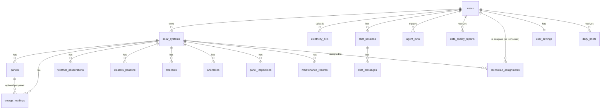

# SolarSense AI — Backend Schema

**Version:** 1.0 · PostgreSQL · Companion to `02_TRD.md`, `08_Agent_Architecture.md`

---

## 1. Conventions (apply to every table)

- **Timezone:** all timestamps stored in UTC (`_utc` suffix). Convert to local time only at display, using `solar_systems.timezone`. Solar generation is tied to local solar time — get this wrong once and every chart is silently off by hours.
- **Multi-tenancy:** every query-facing table has a `user_id` column or a join path to one. Row-level isolation is enforced at the **query/ORM layer** (e.g., Postgres Row-Level Security policies keyed on `user_id`, or an ORM base class that injects the filter automatically) — not only checked in application code, where one missed `WHERE user_id = ?` becomes a cross-user data leak.
- **Model versioning:** any table storing a prediction/finding carries `model_version` so a later model update never silently makes historical records incomparable.
- **Soft trust fields:** anything derived from an ML/vision/LLM process carries a confidence/score field and, where relevant, a `verified_by_user` / `reviewed_by_user` boolean — never presented as fact without that provenance.

## 2. Entity-Relationship Overview



## 3. Tables

```sql
-- Identity & systems -------------------------------------------------

users
  id UUID PK
  email TEXT UNIQUE NOT NULL
  role TEXT NOT NULL DEFAULT 'owner'   -- 'owner' | 'admin' — an account-level default UI mode only.
                                        -- NOT the access-control mechanism for review: a user can own
                                        -- systems AND review others' systems at the same time. Reviewer
                                        -- access to a specific system is granted via technician_assignments
                                        -- below, independent of this field, so the two compose correctly.
  created_at TIMESTAMPTZ NOT NULL DEFAULT now()

technician_assignments                 -- makes "assigned for review" (used by RLS in §4) concrete
  id UUID PK
  technician_user_id UUID FK -> users.id NOT NULL
  solar_system_id UUID FK -> solar_systems.id NOT NULL
  assigned_at TIMESTAMPTZ NOT NULL DEFAULT now()
  revoked_at TIMESTAMPTZ NULL          -- soft-revoke instead of delete, for audit history
  UNIQUE (technician_user_id, solar_system_id)

solar_systems
  id UUID PK
  user_id UUID FK -> users.id NOT NULL
  capacity_kw NUMERIC NOT NULL
  tilt_deg NUMERIC NOT NULL
  azimuth_deg NUMERIC NOT NULL
  latitude NUMERIC NOT NULL
  longitude NUMERIC NOT NULL
  timezone TEXT NOT NULL              -- IANA tz, e.g. 'Asia/Kolkata'
  installed_at DATE
  created_at TIMESTAMPTZ NOT NULL DEFAULT now()

panels                                 -- only populated if optimizer/microinverter data exists
  id UUID PK
  solar_system_id UUID FK -> solar_systems.id NOT NULL
  position_label TEXT                 -- e.g. 'east-corner', user- or vendor-supplied
  capacity_w NUMERIC

-- Time series ---------------------------------------------------------

energy_readings
  id UUID PK
  solar_system_id UUID FK -> solar_systems.id NOT NULL
  panel_id UUID FK -> panels.id NULL   -- null = system-level aggregate
  reading_time_utc TIMESTAMPTZ NOT NULL
  kwh NUMERIC NOT NULL
  source TEXT NOT NULL                 -- 'csv_upload' | 'api' | 'simulated'
  -- Uniqueness split in two: Postgres treats NULL <> NULL in a plain UNIQUE
  -- constraint, so a naive UNIQUE(solar_system_id, panel_id, reading_time_utc)
  -- silently allows duplicate system-level rows (panel_id IS NULL is the
  -- common case). Enforced instead via two indexes (see §6 Indexing Notes):
  --   1. UNIQUE (solar_system_id, panel_id, reading_time_utc) WHERE panel_id IS NOT NULL
  --   2. UNIQUE (solar_system_id, reading_time_utc) WHERE panel_id IS NULL

weather_observations
  id UUID PK
  solar_system_id UUID FK -> solar_systems.id NOT NULL
  observed_time_utc TIMESTAMPTZ NOT NULL
  ghi NUMERIC                          -- global horizontal irradiance
  cloud_cover NUMERIC
  temperature NUMERIC
  source TEXT NOT NULL                 -- provider name

clearsky_baseline
  id UUID PK
  solar_system_id UUID FK -> solar_systems.id NOT NULL
  target_time_utc TIMESTAMPTZ NOT NULL
  expected_kwh NUMERIC NOT NULL
  model_version TEXT NOT NULL          -- pvlib version / config hash
  UNIQUE (solar_system_id, target_time_utc)

forecasts
  id UUID PK
  solar_system_id UUID FK -> solar_systems.id NOT NULL
  forecast_made_at_utc TIMESTAMPTZ NOT NULL   -- vintage: when generated
  target_time_utc TIMESTAMPTZ NOT NULL        -- what it predicts
  predicted_kwh NUMERIC NOT NULL
  predicted_kwh_low NUMERIC                    -- prediction interval
  predicted_kwh_high NUMERIC
  model_version TEXT NOT NULL

-- Documents & vision ----------------------------------------------------

electricity_bills
  id UUID PK
  user_id UUID FK -> users.id NOT NULL
  solar_system_id UUID FK -> solar_systems.id NULL
  utility_name TEXT
  billing_period_start DATE
  billing_period_end DATE
  units_consumed NUMERIC
  total_amount NUMERIC
  tariff_rate NUMERIC
  fixed_charges NUMERIC
  extraction_confidence NUMERIC        -- 0..1, per-extraction overall
  reconciliation_pass BOOLEAN
  reconciliation_delta NUMERIC          -- stored, not recomputed-only: |stated total - (units*tariff+fixed)|,
                                         -- so the UI (04_Wireframes.md bill screen) can show the actual
                                         -- delta without re-deriving it on every view
  raw_file_ref TEXT NOT NULL           -- storage pointer, not inline blob
  verified_by_user BOOLEAN NOT NULL DEFAULT false
  model_version TEXT NOT NULL
  created_at TIMESTAMPTZ NOT NULL DEFAULT now()

panel_inspections
  id UUID PK
  panel_id UUID FK -> panels.id NULL
  solar_system_id UUID FK -> solar_systems.id NOT NULL
  image_ref TEXT NOT NULL
  image_type TEXT NOT NULL DEFAULT 'rgb'   -- 'rgb' | 'thermal'
  finding_label TEXT NOT NULL              -- 'soiling'|'damage'|'shading'|'other_unclear'
                                            -- Deliberate simplification: one photo -> one row -> one label.
                                            -- Co-occurring issues (e.g. soiling + shading in the same photo)
                                            -- are represented as two panel_inspections rows for the same
                                            -- image_ref with different finding_label + model_score, not as
                                            -- a multi-label field on one row.
  model_score NUMERIC NOT NULL             -- explicitly NOT a probability unless calibrated
  is_calibrated BOOLEAN NOT NULL DEFAULT false
  model_version TEXT NOT NULL
  reviewed_by_user BOOLEAN NOT NULL DEFAULT false
  review_outcome TEXT                      -- 'confirmed' | 'rejected' | NULL
  created_at TIMESTAMPTZ NOT NULL DEFAULT now()

-- Derived analysis --------------------------------------------------------

anomalies
  id UUID PK
  solar_system_id UUID FK -> solar_systems.id NOT NULL
  detected_at_utc TIMESTAMPTZ NOT NULL
  clearsky_kwh NUMERIC NOT NULL
  weather_adjusted_kwh NUMERIC NOT NULL
  actual_kwh NUMERIC NOT NULL
  deviation_pct NUMERIC NOT NULL
  weather_explained_pct NUMERIC NOT NULL
  unexplained_pct NUMERIC NOT NULL       -- the actual anomaly signal
  status TEXT NOT NULL DEFAULT 'open'     -- 'open'|'reviewed'|'dismissed'
  model_version TEXT NOT NULL

maintenance_records
  id UUID PK
  solar_system_id UUID FK -> solar_systems.id NOT NULL
  event_type TEXT NOT NULL               -- 'cleaning'|'repair'|'inspection'|'other'
  event_time_utc TIMESTAMPTZ NOT NULL
  notes TEXT

data_quality_reports
  id UUID PK
  user_id UUID FK -> users.id NOT NULL
  solar_system_id UUID FK -> solar_systems.id NULL
  upload_ref TEXT NOT NULL
  issues_json JSONB NOT NULL             -- missing values, dupes, spikes, gaps found
  passed BOOLEAN NOT NULL
  created_at TIMESTAMPTZ NOT NULL DEFAULT now()

-- Conversational / agentic -------------------------------------------------

chat_sessions
  id UUID PK
  user_id UUID FK -> users.id NOT NULL
  solar_system_id UUID FK -> solar_systems.id NULL
  created_at TIMESTAMPTZ NOT NULL DEFAULT now()

chat_messages
  id UUID PK
  chat_session_id UUID FK -> chat_sessions.id NOT NULL
  role TEXT NOT NULL                     -- 'user'|'assistant'|'tool'
  content TEXT NOT NULL
  tool_call_json JSONB                    -- if role='tool'
  created_at TIMESTAMPTZ NOT NULL DEFAULT now()

agent_runs
  id UUID PK
  user_id UUID FK -> users.id NOT NULL
  solar_system_id UUID FK -> solar_systems.id NULL   -- lets cost roll up per system, not just per user
  surface TEXT NOT NULL                 -- 'why_drop_narration'|'daily_brief'|'copilot'|'bill_extraction'|'report_export'
                                         -- without this, all LLM spend lands in one bucket per user and
                                         -- 09_Claude_Integration.md §7's per-surface cost gate can't be measured
  chat_message_id UUID FK -> chat_messages.id NULL
  tool_calls_json JSONB NOT NULL
  latency_ms INTEGER NOT NULL
  cost_usd NUMERIC NOT NULL
  model_version TEXT NOT NULL
  created_at TIMESTAMPTZ NOT NULL DEFAULT now()

daily_briefs                            -- persists the actual narrated brief, not just its cost/latency
  id UUID PK
  user_id UUID FK -> users.id NOT NULL
  solar_system_id UUID FK -> solar_systems.id NOT NULL
  brief_date DATE NOT NULL
  content TEXT NOT NULL                 -- the narrated text actually shown/sent that day
  degraded BOOLEAN NOT NULL DEFAULT false  -- true if sent as numbers-only fallback (LLM unavailable that day)
  agent_run_id UUID FK -> agent_runs.id NULL
  created_at TIMESTAMPTZ NOT NULL DEFAULT now()
  UNIQUE (user_id, solar_system_id, brief_date)

user_settings                            -- backs the Notification Preferences screen (05_UI_UX_Flow.md §1)
  user_id UUID PK FK -> users.id
  daily_brief_enabled BOOLEAN NOT NULL DEFAULT true
  daily_brief_channel TEXT NOT NULL DEFAULT 'in_app'   -- 'in_app' | 'email' | 'both'
  daily_brief_send_time_local TIME NOT NULL DEFAULT '07:00'
  updated_at TIMESTAMPTZ NOT NULL DEFAULT now()

-- RAG (narrowed scope) ------------------------------------------------------

knowledge_documents
  id UUID PK
  user_id UUID FK -> users.id NOT NULL
  solar_system_id UUID FK -> solar_systems.id NULL
  doc_type TEXT NOT NULL                  -- 'manual'|'maintenance_history'|'standard'
  source_ref TEXT NOT NULL
  created_at TIMESTAMPTZ NOT NULL DEFAULT now()

knowledge_chunks
  id UUID PK
  knowledge_document_id UUID FK -> knowledge_documents.id NOT NULL
  chunk_text TEXT NOT NULL
  embedding VECTOR(1536)                  -- pgvector; swap to ChromaDB only if pgvector proves insufficient.
                                           -- 1536 dims = a stated decision, not incidental: assumes an
                                           -- OpenAI-family embedding model (e.g. text-embedding-3-small) for
                                           -- retrieval only — narration/Copilot generation stays on Claude
                                           -- per 09_Claude_Integration.md. If that changes, this column's
                                           -- dimension is a migration, not a config flag; record the exact
                                           -- embedding model/version alongside each chunk if it may ever change.
```

## 4. Isolation Enforcement

- Enable Postgres **Row-Level Security** on every user-scoped table; policy predicate `user_id = current_setting('app.current_user_id')::uuid` (or joined equivalent for child tables like `energy_readings` via `solar_systems.user_id`).
- Application sets `app.current_user_id` once per request/session from the authenticated principal — never trust a client-supplied `user_id`.
- ORM layer additionally scopes every query by `user_id` as defense-in-depth (RLS is the hard backstop, not the only layer).
- Reviewer access is **system-scoped, not account-scoped**: a user reviews a given system's `anomalies` + `panel_inspections` if and only if an active row exists in `technician_assignments (technician_user_id = current_user, solar_system_id = target, revoked_at IS NULL)` — this is what makes "assigned for review" concrete rather than implied by `users.role`. The RLS policy predicate for these two tables is therefore an `EXISTS` join against `technician_assignments`, not a check against `role`. No access to `electricity_bills`, `chat_messages`, or any other table via this path. A user can simultaneously be an owner on their own `solar_systems` rows (via the standard `user_id` policy) and a reviewer on others' via this policy — the two are independent and compose.

## 5. Retention & Privacy

- `raw_file_ref` (bills, panel images) points to object storage with a documented retention window (e.g., 24 months, configurable), not permanent-by-default.
- A user-initiated delete cascades: `electricity_bills`, `panel_inspections`, `energy_readings`, `chat_messages`/`chat_sessions` for that `user_id`, plus the underlying object-storage files.
- PII fields (name, address, consumer number) inside bill extraction are redacted/masked before any payload is sent to a third-party LLM API where feasible; where full-image vision extraction requires the unredacted image, that data flow is documented explicitly in the privacy notice, not left implicit.

## 6. Indexing Notes

- `energy_readings (solar_system_id, reading_time_utc)` — primary query path for dashboard/forecast windows.
- `energy_readings` uniqueness (fixes the NULL-doesn't-dedupe gap in §3):
  ```sql
  CREATE UNIQUE INDEX ON energy_readings (solar_system_id, panel_id, reading_time_utc)
    WHERE panel_id IS NOT NULL;
  CREATE UNIQUE INDEX ON energy_readings (solar_system_id, reading_time_utc)
    WHERE panel_id IS NULL;
  ```
- `anomalies (solar_system_id, detected_at_utc, status)` — review queue and dashboard flagging.
- `technician_assignments (technician_user_id, solar_system_id) WHERE revoked_at IS NULL` — RLS join path for reviewer access (§4).
- `knowledge_chunks (embedding)` — IVFFlat/HNSW index via pgvector once RAG is built.
- Partial index on `panel_inspections (reviewed_by_user) WHERE reviewed_by_user = false` — review queue.
- `daily_briefs (user_id, solar_system_id, brief_date)` — already unique (§3); doubles as the lookup index for "show me yesterday's brief again."
